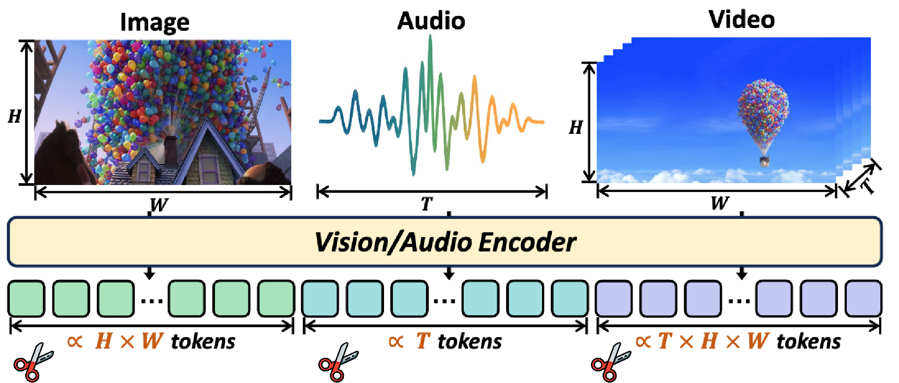

# Awesome-Token-Pruning-and-Merging-for-Multimodal-Large-Language-Models  

  

> Curated papers/code on token **pruning/merging/resampling/selection** for **MLLMs** (image / video / audio).  
> Scope: training-free inference compression, projector/resampler design, ViT building-blocks used in MLLMs.

## Contents
- 🖼️ Image-LLM | 📽️ Video-LLM | 🔊 Audio-LLM
- 🔌 Projector & Resampler (Q-Former / Perceiver / Pixel-Shuffle / TokenPacker)
- 🧱 ViT Building Blocks (DynamicViT / EViT / ToMe …)

## How to Read the Table
- **stage**: pre-encoder / post-encoder / pre-LLM / in-LLM / decode(KV)
- **method**: pruning | merging | selection | pooling | query-based
- **training**: training-free | fine-tune | from-scratch

## Early Work

<strong style="font-size: 20px">Image</strong>

- [An Image is Worth 1/2 Tokens After Layer 2: Plug-and-Play Inference Acceleration for Large Vision-Language Models](https://arxiv.org/abs/2403.06764)   
- [AIM: Adaptive Inference of Multi-Modal LLMs via Token Merging and Pruning](https://arxiv.org/abs/2412.03248).
- [AIM: Let Any Multi-modal Large Language Models Embrace Efficient In-Context Learning](https://arxiv.org/abs/2406.07588).
- [Variation-aware Vision Token Dropping for Faster Large Vision-Language Models](https://arxiv.org/abs/2509.01552).
- [Filter, Correlate, Compress: Training-Free Token Reduction for MLLM Acceleration](https://arxiv.org/abs/2411.17686).

<strong style="font-size: 20px">Video</strong>

<strong style="font-size: 20px">Audio</strong>

---

## Recent Work

<strong style="font-size: 20px">Image</strong>

<strong style="font-size: 20px">Video</strong>

<strong style="font-size: 20px">Audio</strong>

---

## 📄 License

This project is licensed under the MIT License - see the [LICENSE](LICENSE) file for details.

---

## 🧑‍💻 Contributors

👏 Thanks to these contributors for this excellent work！

## ✉️ Contact

For questions, suggestions, or collaboration opportunities, please feel free to reach out:

✉️ Email:  [wengshichao2@gmail.com](wengshichao2@gmail.com) / [zhouyuhua@zju.edu.cn](mailto:zhouyuhua@zju.edu.cn) / [joeqian@aliyun.com](mailto:joeqian@aliyun.com)

## ✨ Star History

